# AWS Disaster Recovery Project with Jenkins CI/CD Implementation

## Table of Contents
1. [Introduction](#introduction)
2. [Project Overview](#project-overview)
   - [Architecture](#architecture)
   - [Key Components](#key-components)
   - [Project Directory Structure](#project-directory-structure)
3. [Infrastructure Details](#infrastructure-details)
   - [VPC and Networking](#1-vpc-and-networking)
   - [EC2 (Elastic Compute Cloud)](#2-ec2-elastic-compute-cloud)
   - [RDS (Relational Database Service)](#3-rds-relational-database-service)
   - [S3 (Simple Storage Service)](#4-s3-simple-storage-service)
   - [Lambda (Serverless Compute)](#5-lambda-serverless-compute)
   - [Application Load Balancer (ALB)](#6-application-load-balancer-alb)
   - [Global Accelerator](#7-global-accelerator)
   - [IAM](#8-iam)
   - [Monitoring and Failover](#9-monitoring-and-failover)
4. [Setup Instructions](#setup-instructions)
   - [Prerequisites](#prerequisites)
   - [Step-by-Step Deployment](#step-by-step-deployment)
5. [Disaster Recovery Process](#disaster-recovery-process)
   - [Trigger Event](#1-trigger-event)
   - [Scaling the Pilot Light](#2-scaling-the-pilot-light)
   - [Data Synchronization](#3-data-synchronization)
   - [Operational Testing](#4-operational-testing)
6. [Maintenance and Monitoring](#maintenance-and-monitoring)
   - [Automated Backups](#automated-backups)
   - [CloudWatch Monitoring](#cloudwatch-monitoring)
7. [Cost Considerations](#cost-considerations)
   - [Pilot Light Strategy Benefits](#pilot-light-strategy-benefits)
   - [Optimization Tips](#optimization-tips)
8. [Jenkins CI/CD Infrastructure as Code Implementation](#jenkins-cicd-infrastructure-as-code-implementation)
   - [Introduction](#jenkins-introduction)
   - [Jenkins Setup](#jenkins-setup)
   - [Pipeline Configuration](#pipeline-configuration)
   - [Integration with Version Control](#integration-with-version-control)
   - [Security Best Practices](#security-best-practices)
   - [Monitoring and Maintenance](#jenkins-monitoring-and-maintenance)
   - [Troubleshooting](#jenkins-troubleshooting)
9. [Troubleshooting](#troubleshooting)
   - [Common Issues and Solutions](#common-issues-and-solutions)
10. [Security Considerations](#security-considerations)
11. [Conclusion](#conclusion)
12. [Additional Resources](#additional-resources)

## Introduction

This is a comprehensive Disaster Recovery (DR) project utilizing Terraform to deploy a LAMP (Linux, Apache, MySQL, PHP) stack in AWS, implementing the **Pilot Light strategy**. The primary objective is to ensure the availability of critical AWS services—EC2, RDS, S3, and Lambda—with minimal operational overhead and rapid recovery capabilities in the event of a disaster.

The project leverages a multi-region architecture with a **primary region** (`eu-west-1`) hosting the active LAMP stack and a **secondary region** (`us-east-1`) maintaining a minimal "pilot light" setup. This minimal environment can be quickly scaled up during a disaster to ensure business continuity. Terraform is used as the Infrastructure as Code (IaC) tool, enabling repeatable, version-controlled deployments across both regions. The solution includes automated failover mechanisms, data replication, and monitoring to meet the project's goals of resilience and efficiency.

## Project Overview

The DR Project AWS follows the Pilot Light strategy, where the secondary region maintains a reduced set of resources that can be activated swiftly during a disaster. The infrastructure is modularized using Terraform, with separate modules for each AWS service, ensuring maintainability and scalability.

### Architecture

The overall architecture implements a cross-region disaster recovery solution with automated failover capabilities:


### Key Components

1. **EC2 (Elastic Compute Cloud)**:
   - **Primary Region**: Hosts active EC2 instances within an Auto Scaling Group (ASG) to serve the LAMP application.
   - **Secondary Region**: Maintains stopped EC2 instances (minimal pilot light) that scale up during failover using ASGs and a pre-configured AMI.

2. **RDS (Relational Database Service)**:
   - **Primary Region**: Runs the primary RDS instance for the LAMP stack database.
   - **Secondary Region**: Hosts a Read Replica that can be promoted to primary during failover, with automated backups enabled.

3. **S3 (Simple Storage Service)**:
   - Implements Cross-Region Replication (CRR) to synchronize data between primary and secondary buckets, with versioning and lifecycle policies for data integrity and cost management.

4. **Lambda (Serverless Compute)**:
   - Deploys functions in the secondary region to automate failover tasks (scaling EC2, promoting RDS) and create daily RDS snapshots.

5. **VPC and Networking**:
   - Configures separate VPCs in each region with public and private subnets, secured by security groups, and uses AWS Global Accelerator for traffic routing.

6. **Application Load Balancer (ALB)**:
   - Distributes traffic to EC2 instances in both regions, with health checks to determine region availability.

7. **Global Accelerator**:
   - Routes user traffic to the healthy region based on ALB health checks, ensuring low-latency failover.

8. **IAM**:
   - Defines roles and policies for S3 replication, EC2 instance profiles, and Lambda execution.

9. **Monitoring**:
   - Uses CloudWatch to monitor resource health and trigger failover when necessary using ping strategy.

10. **AMI (Amazon Machine Image)**:
    - Pre-configured AMI for consistent and rapid deployment of EC2 instances in both regions.

### Project Directory Structure

The project is organized as follows:

```
.
├── bash_scripts
│   ├── nuke.sh              # tear down all networking resources
│   └── state_file.sh        # manage Terraform state backend
├── main.tf                  # root Terraform config
├── modules                  # reusable service modules
│   ├── alb                  # ALB setup
│   ├── ami                  # EC2 AMI handling
│   ├── asg_launch_template  # Launch Template & ASG definitions
│   ├── ecr                  # ECR repo setup
│   ├── global_accelerator   # Global Accelerator config
│   ├── iam                  # IAM roles & policies
│   ├── manual_snapshot      # Lambda RDS snapshots 
│   ├── primary_monitoring   # CloudWatch alarms for primary
│   ├── rds                  # RDS & replica setup
│   ├── s3                   # S3 buckets & replication
│   ├── secondary_failover   # failover orchestration
│   ├── security_group       # security groups
│   └── vpc                  # VPC & subnet layout
├── outputs.tf               # Terraform outputs
├── providers.tf             # AWS provider config
├── README.MD                # project overview & steps
├── state-bootstrap          # init remote state setup
├── terraform.tfvars         # variable values
└── variables.tf             # variable declarations
```

## Infrastructure Details

### 1. VPC and Networking
- **Primary VPC**:
  - Defined in the `vpc` module with a CIDR block (`10.0.0.0/16`), public subnets (`10.0.1.0/24`, `10.0.2.0/24`), and private subnets (`10.0.3.0/24`, `10.0.4.0/24`) across multiple availability zones.
  - Security groups (`security_group` module) control traffic to EC2, RDS, and ALB.
- **Secondary VPC**:
  - Mirrored setup in the `vpc_secondary` module with a distinct CIDR (`10.0.0.0/16`) and similar subnet configurations.
- **Global Accelerator**:
  - Configured in the `global_accelerator` module to route traffic between primary and secondary ALBs based on health checks (`/ref` path).

**Project FlowChart**:  
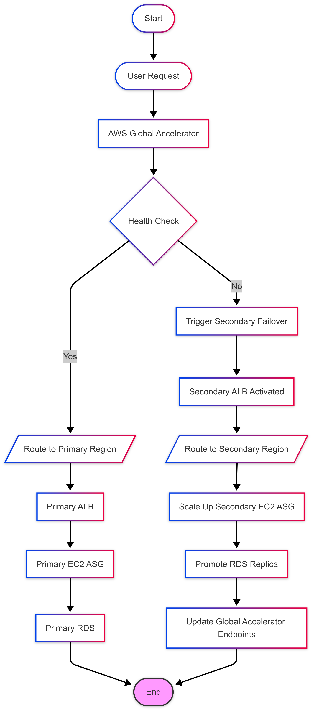

### 2. EC2 (Elastic Compute Cloud)
- **Primary Region**:
  - Deployed via the `ec2` module with an ASG (`primary_asg_name`) set to a `desired_capacity` (2). Instances use an IAM instance profile and connect to the primary ALB target group.
- **Secondary Region**:
  - Configured in the `ec2_secondary` module with `min_size = 0` and `desired_capacity = 0`, keeping instances stopped to minimize costs. Scaled up during failover using ASG and Amazon AMI.
- **AMI Management**:
  - The `ami` module manages the creation and deployment of pre-configured machine images for consistent LAMP stack deployment.
- **Automation**:
  - ASG policies and Lambda functions (`secondary_failover`) automate scaling during disasters.

**Failover Initialization**:  
 

### 3. RDS (Relational Database Service)

- **Primary RDS**:
  - Managed by the `rds` module in the primary region, configured with `multi_az = false` for cost savings. The master password is stored in AWS Systems Manager (SSM) Parameter Store.
- **Secondary RDS**:
  - A Read Replica (`aws_db_instance.replica`) in the secondary region replicates data from the primary instance. It uses a subnet group (`aws_db_subnet_group.replica`) and can be promoted during failover.
- **Backups**:
  - Automated backups with a 1-day retention period and manual snapshots via the `manual_snapshot` Lambda function.

**Database Snapshot**:
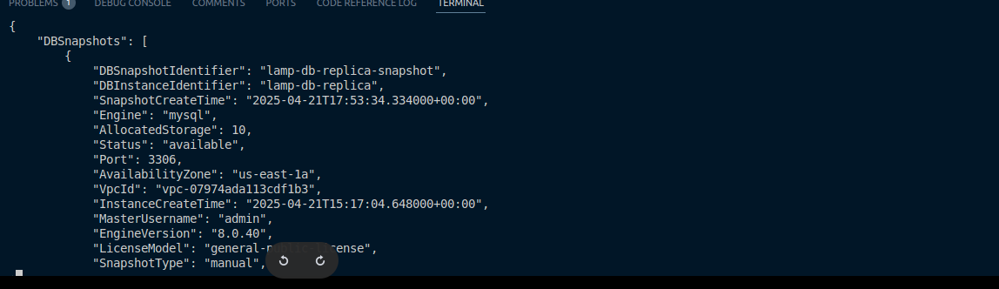

**Promoted RDS Instance**:
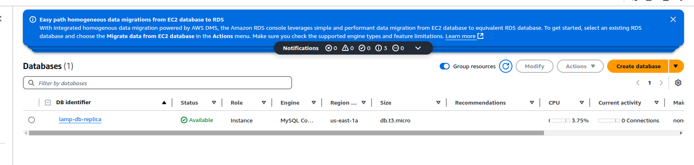 

### 4. S3 (Simple Storage Service)
- **Primary Bucket**:
  - Configured in the `s3` module with versioning and lifecycle policies for cost-effective storage.
- **Secondary Bucket**:
  - Replicates data from the primary bucket using CRR, with an IAM role (`s3_replication_role_arn`) for access.
- **Data Integrity**:
  - Versioning ensures recovery from accidental deletions.

**S3 Write From The Application**:
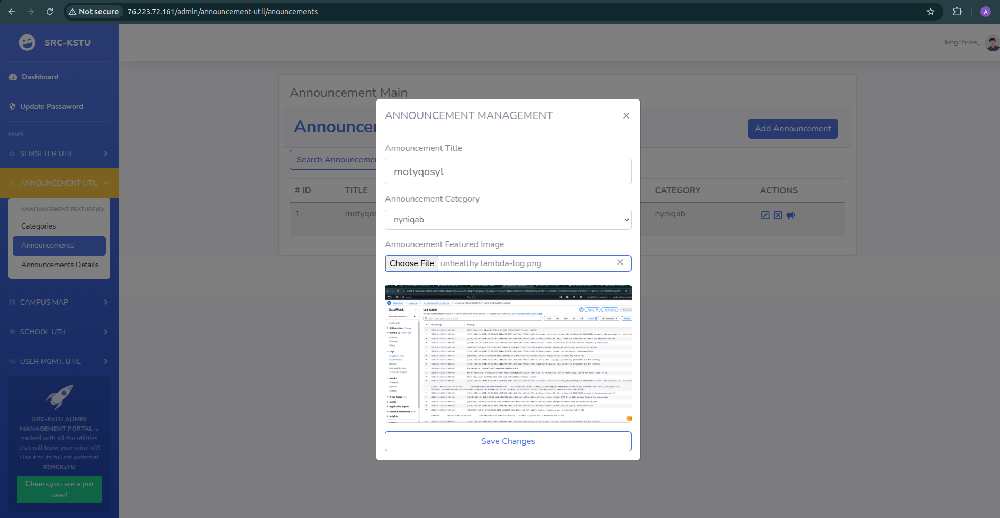 

**Replica Objects From Secondary Bucket**:
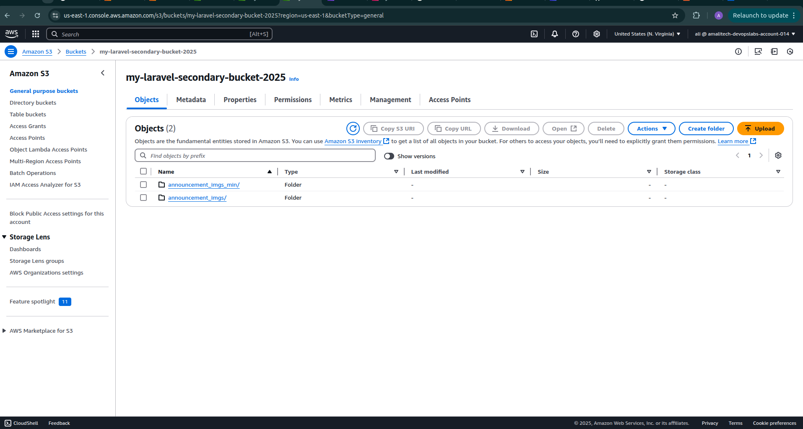

### 5. Lambda (Serverless Compute)
- **Failover Lambda**:
  - Deployed in the `secondary_failover` module, pings the primary ALB at defined intervals and when things are wrong, gets triggered to scale EC2 and promote RDS. Global Accelerator automatically shifts traffic to the secondary region in case of a failure.
- **Snapshot Lambda**:
  - Runs daily at 2 AM (via `schedule_expression` in the `manual_snapshot` module) to create RDS snapshots.
- **Configuration**:
  - Environment variables (ASG names, RDS IDs) are passed to Lambda for region-specific operations.

**RDS Snapshot Creation**:
 

**Snapshot From Lambda**:


**Unhealthy Lambda Logs**:


### 6. Application Load Balancer (ALB)
- **Primary ALB**:
  - Configured in the `alb` module to route traffic to the primary EC2 ASG, monitored by health checks.
- **Secondary ALB**:
  - Defined in the `alb_secondary` module, activated during failover to route traffic to the secondary EC2 ASG.

**Primary ALB Unavailable(Due To unhealthyHosts From my ALB TargetGroups)**:


**Dashboard From Secondary ALB**:
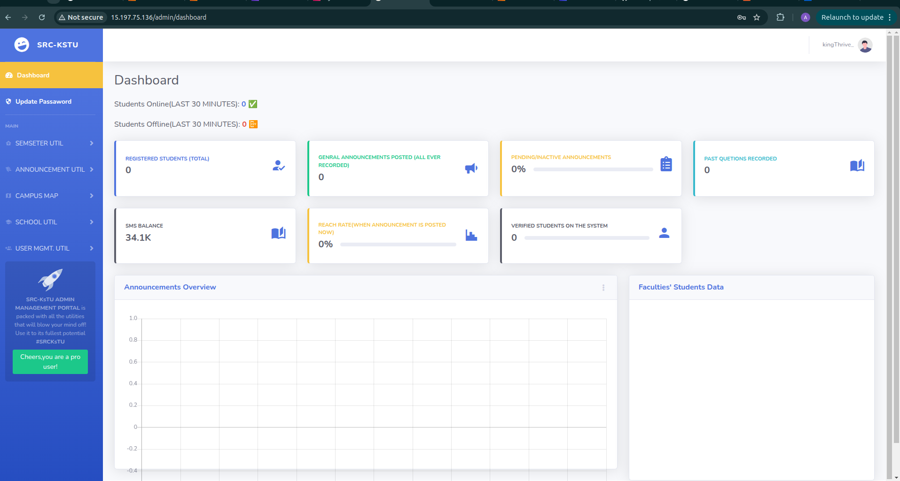

### 7. Global Accelerator
- Routes traffic between primary and secondary ALBs based on health checks, ensuring seamless failover.

**Healthy Global Accelerator States**:
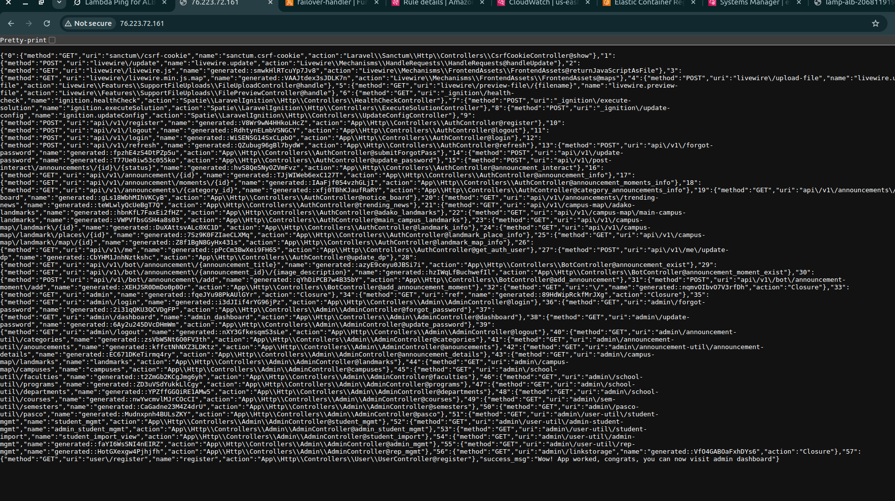
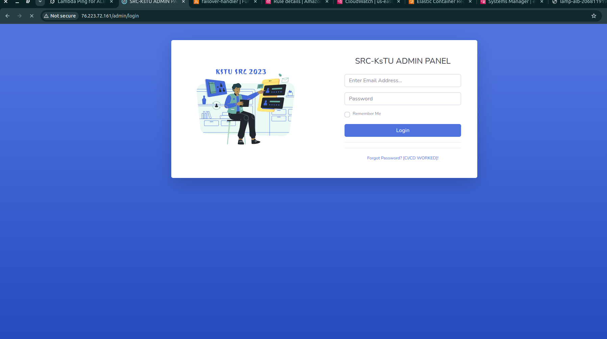 

### 8. IAM
- **Roles and Policies**:
  - Managed by the `iam` module, including roles for S3 replication, EC2 instance profiles, and Lambda execution.
- **SSM Parameter Store**:
  - Stores and replicates the RDS master password across regions.

### 9. Monitoring and Failover
- **Primary Monitoring**:
  - The `primary_monitoring` module uses CloudWatch to monitor ALB health and sends an email.
- **Failover Trigger**:
  - Lambda (`secondary_failover`) initiates failover when the primary region fails, scaling resources and updating routing.

**Successful EC2 Initialization(By Lambda)**:
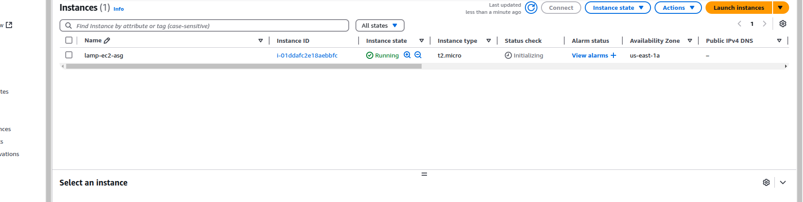

## Setup Instructions

Follow these detailed steps to deploy the DR infrastructure:

### Prerequisites
- **AWS Account**: With IAM permissions for EC2, RDS, S3, Lambda, VPC, ALB, and Global Accelerator.
- **Terraform**: Version `>= 5.0` installed.
- **AWS CLI**: Configured with access keys (`aws configure`).
- **Git**: For cloning the repository.

### Step-by-Step Deployment

1. **Clone the Repository**
   ```bash
   git clone https://github.com/alizaidansp/dr-deployment.git
   cd dr-deployment
   ```

2. **Initialize State Backend**
   - Navigate to the `state-bootstrap` directory:
     ```bash
     cd state-bootstrap
     ```
   - Initialize Terraform and apply the configuration:
     ```bash
     terraform init
     terraform apply -auto-approve
     ```
   - This creates an S3 bucket (`ali-amalitech-state-bucket`)   to store the Terraform state, enabling collaboration and state synchronization.

   **State Lock Test**:
    - Testing to ensure state lock is working properly:
    

3. **Configure Variables**  
   - Create or edit `terraform.tfvars` with your specific values:
     ```hcl
     primary_region                    = "<PRIMARY_REGION>"
     secondary_region                  = "<SECONDARY_REGION>"
     primary_bucket_name               = "<PRIMARY_BUCKET_NAME>"
     secondary_bucket_name             = "<SECONDARY_BUCKET_NAME>"
     vpc_cidr                          = "<VPC_CIDR>"
     public_subnet_cidrs              = ["<PUBLIC_SUBNET_CIDR_1>", "<PUBLIC_SUBNET_CIDR_2>"]
     private_subnet_cidrs             = ["<PRIVATE_SUBNET_CIDR_1>", "<PRIVATE_SUBNET_CIDR_2>"]
     vpc_secondary_cidr               = "<VPC_SECONDARY_CIDR>"
     public_secondary_subnet_cidrs   = ["<PUBLIC_SECONDARY_SUBNET_CIDR_1>", "<PUBLIC_SECONDARY_SUBNET_CIDR_2>"]
     private_secondary_subnet_cidrs  = ["<PRIVATE_SECONDARY_SUBNET_CIDR_1>", "<PRIVATE_SECONDARY_SUBNET_CIDR_2>"]
     db_name                          = "<DB_NAME>"
     db_username                      = "<DB_USERNAME>"
     db_password_ssm_param            = "<SSM_PARAM_NAME>"
     desired_capacity                 = "<PRIMARY_ASG_DESIRED_CAPACITY>"
     secondary_desired_capacity       = "<SECONDARY_ASG_DESIRED_CAPACITY>"
     account_id                       = "<AWS_ACCOUNT_ID>"
     repository_name                  = "<REPOSITORY_NAME>"
     health_check_path                = "<HEALTH_CHECK_PATH>"
     primary_asg_name                 = "<PRIMARY_ASG_NAME>"
     secondary_asg_name               = "<SECONDARY_ASG_NAME>"
     replica_db_identifier            = "<REPLICA_DB_IDENTIFIER>"
     main_db_identifier               = "<MAIN_DB_IDENTIFIER>"
     ami_name                         = "<AMI_NAME>"
     ```

   - Ensure `availability_zones` and `availability_zones_secondary` match your regions (e.g., `["eu-west-1a", "eu-west-1b"]`).

4. **Deploy the Infrastructure**
   - Return to the root directory:
     ```bash
     cd ..
     ```
   - Initialize Terraform and apply the configuration:
     ```bash
     terraform init
     terraform apply -auto-approve
     ```
   - This deploys the full stack across both regions, provisioning VPCs, EC2, RDS, S3, Lambda, ALB, and Global Accelerator.

5. **Verify Deployment**
   - Check outputs for key resources:
     ```bash
     terraform output
     ```
   - Access the application via the Global Accelerator IPs or ALB DNS name:
     ```bash
     echo "ALB DNS: $(terraform output alb_dns_name)"
     echo "Global Accelerator DNS: $(terraform output global_accelerator_dns)"
     ```
   - Confirm S3 replication and RDS Read Replica status in the AWS Console.

## Disaster Recovery Process

The DR process follows the Pilot Light strategy, with automated steps to ensure rapid recovery:

### 1. Trigger Event
- Detected via CloudWatch alarms (ALB unhealthy) or manual intervention.
- Example: Primary ALB returns a 503 error.

**Deregister Targets From Primary ALB**:


**After Deregistering Targets**:
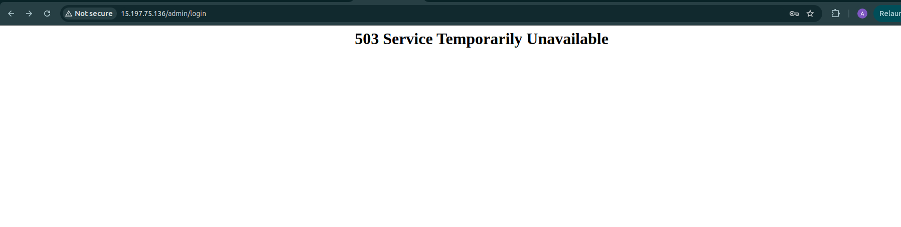

**Removed Primary Target Group**:


### 2. Scaling the Pilot Light
- **EC2**: Lambda triggers the secondary ASG to scale up instances using the pre-configured AMI.
- **RDS**: The Read Replica is promoted to primary.
- **Lambda**: Function is enabled to manage the failover.
- **ALB/Global Accelerator**: Traffic is rerouted to the secondary region.

**Success Failover To Secondary Region**:
 

**Success Failover Complete**:
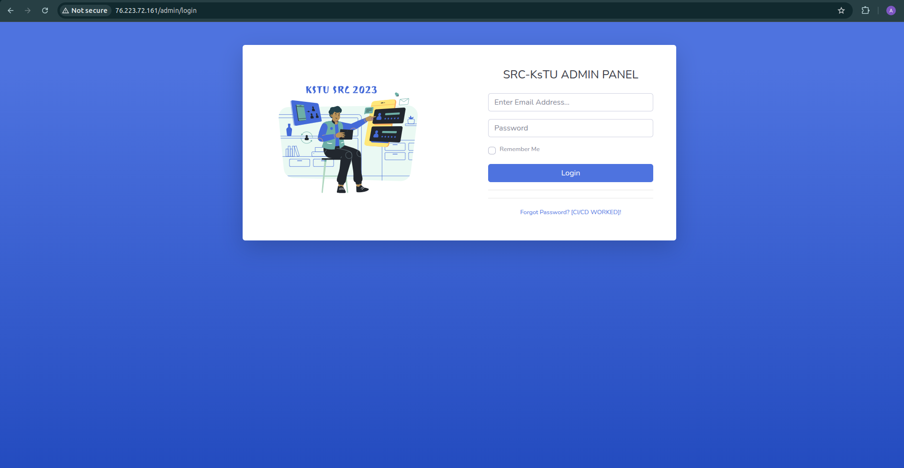

### 3. Data Synchronization
- S3 CRR ensures data availability in the secondary bucket.
- RDS backups and snapshots maintain database consistency.

### 4. Operational Testing 
- Verify the secondary application is accessible and logs are updated.

## Maintenance and Monitoring

### Automated Backups
- **RDS**: 1-day retention period for automated backups.
- **S3**: Versioning and lifecycle policies.
- **Lambda**: Daily snapshots at 2 AM.

**Snapshot (Automatically Created) From Lambda**:
 

### CloudWatch Monitoring
- **Alarms**: 
  - ALB health metrics
  - RDS availability

## Cost Considerations

### Pilot Light Strategy Benefits
- **Stopped EC2 instances** in the secondary region incur only storage costs.
- **Minimal Lambda functions** are kept active, with others triggered only when needed.

### Optimization Tips
- Use lifecycle policies in S3 to transition older objects to lower-cost storage tiers.
- Monitor cross-region data transfer costs (S3 CRR, RDS replication).
- Regularly review and right-size resources based on actual recovery needs.

## Jenkins CI/CD Infrastructure as Code Implementation

### Jenkins Introduction

This section details the Jenkins CI/CD implementation used to automate the deployment of our AWS Disaster Recovery infrastructure. Jenkins serves as the orchestration engine for our Infrastructure as Code (IaC) approach, enabling consistent, repeatable deployments across multiple AWS regions while maintaining security and governance standards.

The Jenkins implementation addresses several key requirements:
- Secure management of AWS and GitHub credentials
- Automated building and pushing of Docker images
- Terraform infrastructure deployment across primary and secondary regions
- Consistent environment setup with version control
- Audit trail for infrastructure changes

### Jenkins Setup

#### Installation and Configuration

Jenkins is deployed as a containerized application, accessible via localhost:8080, providing a scalable and isolated environment for CI/CD operations. The system is configured with the necessary plugins including:

- AWS Integration
- Terraform
- Docker
- Pipeline
- Git Integration
- Blue Ocean for enhanced visualization

#### Credentials Management

Secure credential management is critical for the disaster recovery implementation. The following credentials were configured in Jenkins:

1. **AWS Access Keys**:
   - Configured as global credentials with the ID `MY_AWS_ACCESS_KEY`
   - Includes both Access Key ID and Secret Access Key
   - Permission scope set to global for cross-project accessibility

   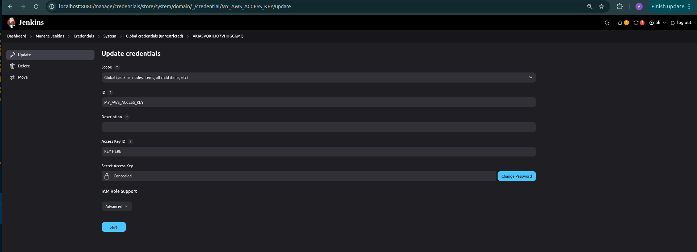

2. **Environment Secrets**:
   - Environment variables needed for configuration of the application stored as `ENV_SECRET_KSTU` 
   - These variables contain configuration parameters for the LAMP stack

   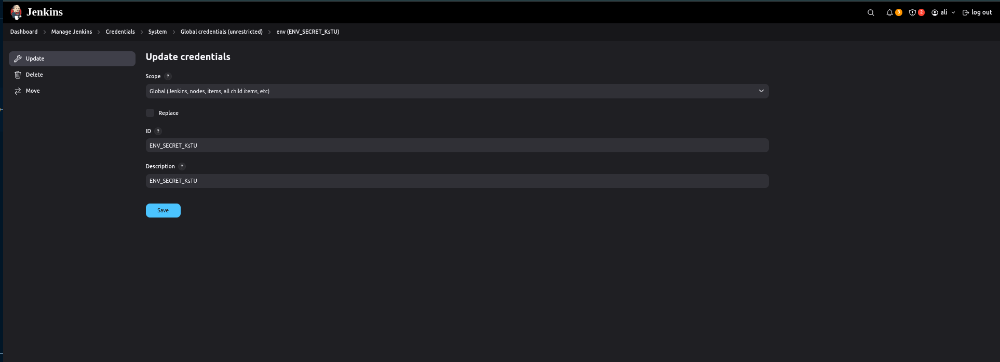

3. **GitHub Personal Access Token (PAT)**:
  
   - Stored securely in Jenkins as `JENKINS_PAT`

   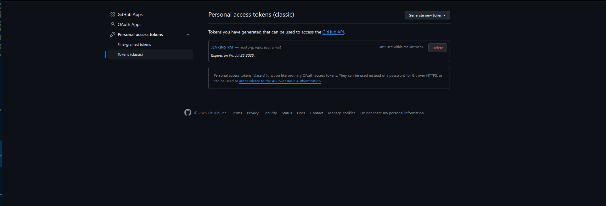
   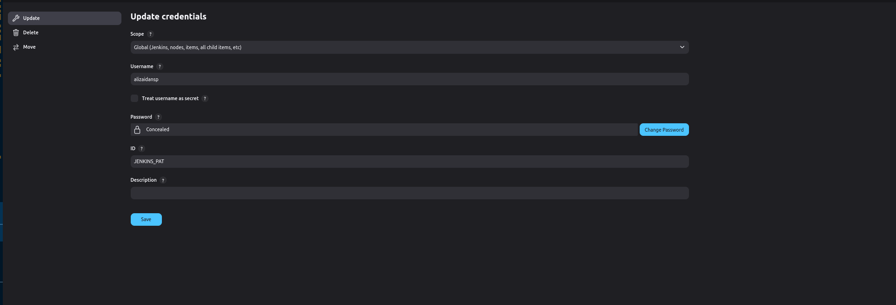

4. **Terraform Variables**:
   - Terraform-specific variables stored as `terraform-tfvars`
   - Contains sensitive configuration for both primary and secondary regions

   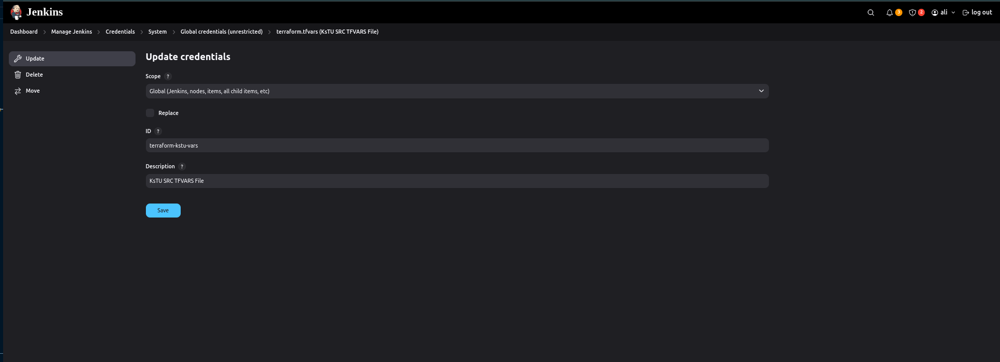

### Pipeline Configuration

#### Pipeline Structure

Two primary pipelines were implemented to manage different aspects of the deployment process:

1. **Docker Image Pipeline**: Builds and pushes the LAMP stack application image to ECR
2. **Disaster Recovery Infrastructure Pipeline**: Deploys the complete multi-region infrastructure using Terraform

#### Dockerfile Pipeline

The Docker pipeline successfully builds and pushes the LAMP application image to ECR with the following stages:

1. Start
2. Prepare Workspace Resources
3. Clone Repository
4. Inject env File
5. Test ECR Access
6. Authenticate Docker to ECR
7. Build Docker Image
8. Tag Docker Image
9. Push Docker Image to ECR
10. End

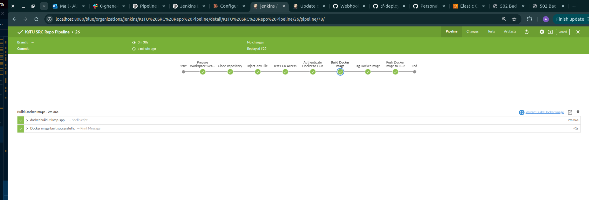

The pipeline takes approximately 2 minutes and 36 seconds to complete, with successful execution of all stages. Key achievements include:
- Successful `docker build` of the LAMP application
- Docker image successfully tagged and pushed to ECR repository

#### Terraform Disaster Recovery Pipeline

The Disaster Recovery Infrastructure pipeline manages the deployment of the entire AWS multi-region architecture with the following stages:

1. Start
2. Deployment Resources
3. Clone Application Repository
4. Inject env File into App Repo
5. Set up Terraform State Backend
6. Inject terraform.tfvars
7. Terraform Init
8. Terraform Plan
9. Cost Estimation
10. Approval
11. Terraform Apply
12. End

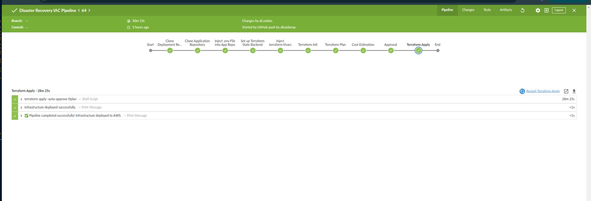

This pipeline successfully completes in 28 minutes and 25 seconds, deploying the complete infrastructure including:
- VPCs and networking components in both regions
- EC2 instances with Auto Scaling Groups
- RDS primary and replica databases
- S3 buckets with cross-region replication
- Lambda functions for failover management
- Global Accelerator for traffic routing


### Integration with Version Control

The Jenkins pipelines integrate with GitHub repositories to ensure infrastructure code is version controlled:

1. **Source Code Management**:
   - Pipelines configured to pull by from specified GitHub repositories
   - Changes triggered by GitHub push events(using Ngrok webhook ) by user "me"

2. **Webhooks**:
   - GitHub webhooks configured to trigger pipeline execution on code changes
   - Ensures infrastructure deployments stay in sync with code updates

### Security Best Practices

Several security measures are implemented in the Jenkins CI/CD setup:

1. **Credential Isolation**:
   - All secrets stored using Jenkins Credential Provider
   - Credentials masked in logs and console output
   - Restricted access to credential management


2. **Secure Parameter Handling**:
   - Sensitive values passed as environment variables
   - Terraform variables injected at runtime
   - No hardcoded secrets in pipeline scripts

### Jenkins Monitoring and Maintenance

The Jenkins environment includes several monitoring and maintenance features:

1. **Pipeline Visualization**:
   - Blue Ocean interface provides clear visualization of pipeline execution
   - Stage-by-stage progress monitoring
   - Easy identification of failed stages

2. **Logging and Auditing**:
   - Comprehensive logs for each build
   - Audit trail of infrastructure changes
   - Error reporting for troubleshooting


### Jenkins Troubleshooting

Common issues and their solutions:

1. **Failed AWS Authentication**:
   - Verify AWS credential validity in Jenkins credential store
   - Check IAM permissions for the configured AWS user
   - Ensure region configuration matches in pipeline and AWS credentials

2. **Terraform State Lock Issues**:
   - Use the included `state_file.sh` script to manage state locks
   - Check S3 bucket access for state storage

3. **GitHub Access Problems**:
   - Verify PAT token expiration date
   - Confirm repository permissions
   - Check webhook configuration in GitHub repository settings

## Troubleshooting

### Common Issues and Solutions

1. **State Lock Issues**: 
   - Use `state_file.sh` to manually create state-files if you dont want use terraform:
     ```bash
     ./bash_scripts/state_file.sh 
     ```
   - If necessary, use `nuke.sh` to reset networking resources:
     ```bash
     ./bash_scripts/nuke.sh
     ```

2. **Failover Failures**: 
   - Check Lambda logs in CloudWatch for detailed error messages.
   - Check IAM permissions for cross-region operations.

3. **AMI Issues**:
   - If AMI deployment fails, verify AMI availability in the secondary region.
   - Check AMI permissions and sharing settings.
   - Use the AWS Console to manually create a new AMI if needed.

4. **Database Connectivity**:
   - Verify security group rules allow proper access.
   - Check RDS parameter groups for configuration consistency.
   - Monitor replication lag between primary and replica.

## Security Considerations

1. **Data Protection**:
   - All sensitive data (like RDS passwords) are stored in AWS SSM Parameter Store.
   - S3 buckets are configured with appropriate access policies.

2. **Network Security**:
   - Security groups are configured with least-privilege access.
   - Private subnets are used for sensitive resources (RDS and EC2).
   - VPC endpoints minimize public internet exposure.

3. **Access Control**:
   - IAM roles follow the principle of least privilege.
   - Resource policies restrict access to specific AWS accounts and services.

## Conclusion

This AWS Disaster Recovery Project implements the Pilot Light strategy effectively, ensuring minimal costs and rapid recovery using Terraform and AWS services. The solution balances cost efficiency with recovery time objectives by maintaining critical infrastructure components in a scaled-down state in the secondary region.

The Jenkins CI/CD implementation provides a robust, secure, and automated approach to deploying and managing the infrastructure across multiple regions. Through careful credential management, pipeline orchestration, and version control integration, the project achieves reliable and consistent infrastructure deployment while maintaining security and governance standards.

Regular testing and maintenance will keep the solution robust and aligned with business needs. The modular Terraform approach and automated Jenkins pipelines allow for easy updates and extensions as requirements evolve.

## Additional Resources

- [AWS Disaster Recovery Documentation](https://aws.amazon.com/disaster-recovery/)
- [Terraform Documentation](https://www.terraform.io/docs)
- [AWS Well-Architected Framework: Reliability Pillar](https://docs.aws.amazon.com/wellarchitected/latest/reliability-pillar/welcome.html)
- [Jenkins Documentation](https://www.jenkins.io/doc/)


