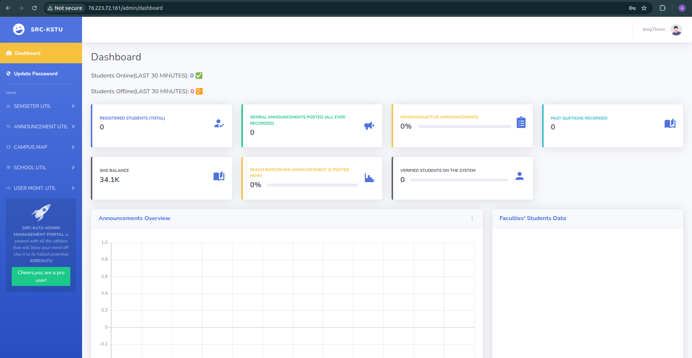

# AWS Disaster Recovery Project

## Introduction

This is a comprehensive Disaster Recovery (DR) project utilizing Terraform to deploy a LAMP (Linux, Apache, MySQL, PHP) stack in AWS, implementing the **Pilot Light strategy**. The primary objective is to ensure the availability of critical AWS services—EC2, RDS, S3, and Lambda—with minimal operational overhead and rapid recovery capabilities in the event of a disaster.

The project leverages a multi-region architecture with a **primary region** (`eu-west-1`) hosting the active LAMP stack and a **secondary region** (`us-east-1`) maintaining a minimal "pilot light" setup. This minimal environment can be quickly scaled up during a disaster to ensure business continuity. Terraform is used as the Infrastructure as Code (IaC) tool, enabling repeatable, version-controlled deployments across both regions. The solution includes automated failover mechanisms, data replication, and monitoring to meet the project's goals of resilience and efficiency.

## Project Overview

The DR Project AWS follows the Pilot Light strategy, where the secondary region maintains a reduced set of resources that can be activated swiftly during a disaster. The infrastructure is modularized using Terraform, with separate modules for each AWS service, ensuring maintainability and scalability.

### Key Components

1. **EC2 (Elastic Compute Cloud)**:
   - **Primary Region**: Hosts active EC2 instances within an Auto Scaling Group (ASG) to serve the LAMP application.
   - **Secondary Region**: Maintains stopped EC2 instances (minimal pilot light) that scale up during failover using ASGs and a pre-configured AMI.

2. **RDS (Relational Database Service)**:
   - **Primary Region**: Runs the primary RDS instance for the LAMP stack database.
   - **Secondary Region**: Hosts a Read Replica that can be promoted to primary during failover, with automated backups enabled.

3. **S3 (Simple Storage Service)**:
   - Implements Cross-Region Replication (CRR) to synchronize data between primary and secondary buckets, with versioning and lifecycle policies for data integrity and cost management.

4. **Lambda (Serverless Compute)**:
   - Deploys functions in the secondary region to automate failover tasks (scaling EC2, promoting RDS) and create daily RDS snapshots.

5. **VPC and Networking**:
   - Configures separate VPCs in each region with public and private subnets, secured by security groups, and uses AWS Global Accelerator for traffic routing.

6. **Application Load Balancer (ALB)**:
   - Distributes traffic to EC2 instances in both regions, with health checks to determine region availability.

7. **Global Accelerator**:
   - Routes user traffic to the healthy region based on ALB health checks, ensuring low-latency failover.

8. **IAM**:
   - Defines roles and policies for S3 replication, EC2 instance profiles, and Lambda execution.

9. **Monitoring**:
   - Uses CloudWatch to monitor resource health and trigger failover when necessary.

10. **AMI (Amazon Machine Image)**:
    - Pre-configured AMI for consistent and rapid deployment of EC2 instances in both regions.

### Project Directory Structure

The project is organized as follows:

```
.
├── bash_scripts
│   ├── nuke.sh              # Script to destroy all resources
│   └── state_file.sh        # Script to manage Terraform state
├── image_assets             # Directory for screenshots
│   ├── Failover-init by lambda ec2.png
│   ├── Flowchart.png
│   ├── ga-healthy-2.png
│   ├── ga-healthy.png
│   ├── Primary -alb-unavailable.png
│   ├── Promoted_rds_instance.png
│   ├── removed primary tg.png
│   ├── s3-write-success.png
│   ├── Secondary-app-accesible.png
│   ├── Snapshot creation-lambda.png
│   ├── Snapshot from lambda.png
│   ├── success-failover-complete.png
│   ├── Test state-lock.png
│   └── many more...
├── main.tf                  # Main Terraform configuration
├── modules                  # Reusable Terraform modules
│   ├── alb
│   ├── ami                  # AMI module for EC2 instances
│   ├── ec2
│   ├── ecr
│   ├── global_accelerator
│   ├── iam
│   ├── manual_snapshot
│   ├── primary_monitoring
│   ├── rds
│   ├── s3
│   ├── secondary_failover
│   ├── security_group
│   └── vpc
├── outputs.tf               # Terraform outputs
├── providers.tf             # Provider configuration
├── README.MD                # This document
├── state-bootstrap          # Terraform state backend setup
├── terraform.tfvars         # Variable definitions
├── test_failover.sh         # Script to test failover
└── variables.tf             # Variable declarations
```

## Infrastructure Details

### 1. VPC and Networking
- **Primary VPC**:
  - Defined in the `vpc` module with a CIDR block (`10.0.0.0/16`), public subnets (`10.0.1.0/24`, `10.0.2.0/24`), and private subnets (`10.0.3.0/24`, `10.0.4.0/24`) across multiple availability zones.
  - Security groups (`security_group` module) control traffic to EC2, RDS, and ALB.
- **Secondary VPC**:
  - Mirrored setup in the `vpc_secondary` module with a distinct CIDR (`10.1.0.0/16`) and similar subnet configurations.
- **Global Accelerator**:
  - Configured in the `global_accelerator` module to route traffic between primary and secondary ALBs based on health checks (`/ref` path).

**Project FlowChart**:  


### 2. EC2 (Elastic Compute Cloud)
- **Primary Region**:
  - Deployed via the `ec2` module with an ASG (`primary_asg_name`) set to a `desired_capacity` (2). Instances use an IAM instance profile and connect to the primary ALB target group.
- **Secondary Region**:
  - Configured in the `ec2_secondary` module with `min_size = 0` and `desired_capacity = 0`, keeping instances stopped to minimize costs. Scaled up during failover using ASG and Amazon AMI.
- **AMI Management**:
  - The `ami` module manages the creation and deployment of pre-configured machine images for consistent LAMP stack deployment.
- **Automation**:
  - ASG policies and Lambda functions (`secondary_failover`) automate scaling during disasters.

**Failover Initialization**:  
 

### 3. RDS (Relational Database Service)

- **Primary RDS**:
  - Managed by the `rds` module in the primary region, configured with `multi_az = false` for cost savings. The master password is stored in AWS Systems Manager (SSM) Parameter Store.
- **Secondary RDS**:
  - A Read Replica (`aws_db_instance.replica`) in the secondary region replicates data from the primary instance. It uses a subnet group (`aws_db_subnet_group.replica`) and can be promoted during failover.
- **Backups**:
  - Automated backups with a 1-day retention period and manual snapshots via the `manual_snapshot` Lambda function.

**Promoted RDS Instance**:
 

### 4. S3 (Simple Storage Service)
- **Primary Bucket**:
  - Configured in the `s3` module with versioning and lifecycle policies for cost-effective storage.
- **Secondary Bucket**:
  - Replicates data from the primary bucket using CRR, with an IAM role (`s3_replication_role_arn`) for access.
- **Data Integrity**:
  - Versioning ensures recovery from accidental deletions.

**S3 Write From The Application**:
 

### 5. Lambda (Serverless Compute)
- **Failover Lambda**:
  - Deployed in the `secondary_failover` module, pings the primary ALB at defined intervals and when things are wrong, gets triggered to scale EC2 and promote RDS. Global Accelerator automatically shifts traffic to the secondary region in case of a failure.
- **Snapshot Lambda**:
  - Runs daily at 2 AM (via `schedule_expression` in the `manual_snapshot` module) to create RDS snapshots.
- **Configuration**:
  - Environment variables (ASG names, RDS IDs) are passed to Lambda for region-specific operations.

**RDS Snapshot Creation**:
 

### 6. Application Load Balancer (ALB)
- **Primary ALB**:
  - Configured in the `alb` module to route traffic to the primary EC2 ASG, monitored by health checks.
- **Secondary ALB**:
  - Defined in the `alb_secondary` module, activated during failover to route traffic to the secondary EC2 ASG.

**Healthy Global Accelerator State**:
 

### 7. Global Accelerator
- Routes traffic between primary and secondary ALBs based on health checks, ensuring seamless failover.

### 8. IAM
- **Roles and Policies**:
  - Managed by the `iam` module, including roles for S3 replication, EC2 instance profiles, and Lambda execution.
- **SSM Parameter Store**:
  - Stores and replicates the RDS master password across regions.

### 9. Monitoring and Failover
- **Primary Monitoring**:
  - The `primary_monitoring` module uses CloudWatch to monitor ALB health and trigger alerts.
- **Failover Trigger**:
  - Lambda (`secondary_failover`) initiates failover when the primary region fails, scaling resources and updating routing.

**Lambda Log For Failover**:
 

## Setup Instructions

Follow these detailed steps to deploy the DR infrastructure:

### Prerequisites
- **AWS Account**: With IAM permissions for EC2, RDS, S3, Lambda, VPC, ALB, and Global Accelerator.
- **Terraform**: Version `>= 1.5.0` installed.
- **AWS CLI**: Configured with access keys (`aws configure`).
- **Git**: For cloning the repository.

### Step-by-Step Deployment

1. **Clone the Repository**
   ```bash
   git clone <repository-url>
   cd dr-deployment
   ```

2. **Initialize State Backend**
   - Navigate to the `state-bootstrap` directory:
     ```bash
     cd state-bootstrap
     ```
   - Initialize Terraform and apply the configuration:
     ```bash
     terraform init
     terraform apply -auto-approve
     ```
   - This creates an S3 bucket (`ali-amalitech-state-bucket`) with DynamoDB to store the Terraform state, enabling collaboration and state synchronization.

   **State Lock Test**:
    

3. **Configure Variables**
   - Create or edit `terraform.tfvars` with your specific values:
     ```hcl
     primary_region          = "eu-west-1"
     secondary_region        = "us-east-1"
     primary_bucket_name     = "primary-lamp-bucket-2023"
     secondary_bucket_name   = "secondary-lamp-bucket-2023"
     vpc_cidr                = "10.0.0.0/16"
     public_subnet_cidrs     = ["10.0.1.0/24", "10.0.2.0/24"]
     private_subnet_cidrs    = ["10.0.3.0/24", "10.0.4.0/24"]
     vpc_secondary_cidr      = "10.1.0.0/16"
     public_secondary_subnet_cidrs = ["10.1.1.0/24", "10.1.2.0/24"]
     private_secondary_subnet_cidrs = ["10.1.3.0/24", "10.1.4.0/24"]
     db_name                 = "lampdb"
     db_username             = "admin"
     db_password_ssm_param   = "/lamp/db/password"
     desired_capacity        = 2
     secondary_desired_capacity = 0
     account_id              = "123456789012"  # Replace with your AWS account ID
     repository_name         = "lamp-ecr"
     health_check_path       = "/ref"
     primary_asg_name        = "primary-asg"
     secondary_asg_name      = "secondary-asg"
     replica_db_identifier   = "lamp-replica"
     main_db_identifier      = "lamp-primary"
     ami_name                = "lamp-stack-ami"  # Name for your AMI
     ```
   - Ensure `availability_zones` and `availability_zones_secondary` match your regions (e.g., `["eu-west-1a", "eu-west-1b"]`).

4. **Deploy the Infrastructure**
   - Return to the root directory:
     ```bash
     cd ..
     ```
   - Initialize Terraform and apply the configuration:
     ```bash
     terraform init
     terraform apply -auto-approve
     ```
   - This deploys the full stack across both regions, provisioning VPCs, EC2, RDS, S3, Lambda, ALB, and Global Accelerator.

5. **Verify Deployment**
   - Check outputs for key resources:
     ```bash
     terraform output
     ```
   - Access the application via the Global Accelerator IPs or ALB DNS name:
     ```bash
     echo "ALB DNS: $(terraform output alb_dns_name)"
     echo "Global Accelerator DNS: $(terraform output global_accelerator_dns)"
     ```
   - Confirm S3 replication and RDS Read Replica status in the AWS Console.

## Disaster Recovery Process

The DR process follows the Pilot Light strategy, with automated steps to ensure rapid recovery:

### 1. Trigger Event
- Detected via CloudWatch alarms (ALB unhealthy) or manual intervention.
- Example: Primary ALB returns a 503 error.

**Deregister Targets From Primary ALB**:
 

### 2. Scaling the Pilot Light
- **EC2**: Lambda triggers the secondary ASG to scale up instances using the pre-configured AMI.
- **RDS**: The Read Replica is promoted to primary.
- **Lambda**: Function is enabled to manage the failover.
- **ALB/Global Accelerator**: Traffic is rerouted to the secondary region.

**Success Failover To Secondary Region**:
 

### 3. Data Synchronization
- S3 CRR ensures data availability in the secondary bucket.
- RDS backups and snapshots maintain database consistency.

### 4. Operational Testing
- Simulate a disaster using `test_failover.sh`:
  ```bash
  ./test_failover.sh
  ```
- Verify the secondary application is accessible and logs are updated.

### 5. Post-Recovery Operations
- Once the primary region is restored:
  1. Resynchronize data from the secondary region back to primary
  2. Update Global Accelerator to revert traffic and scale down secondary resources
  3. Reset the environment to normal operating state

## Maintenance and Monitoring

### Automated Backups
- **RDS**: 1-day retention period for automated backups.
- **S3**: Versioning and lifecycle policies.
- **Lambda**: Daily snapshots at 2 AM.

**Snapshot (Automatically Created) From Lambda**:
 

### CloudWatch Monitoring
- **Alarms**: 
  - EC2 health metrics
  - RDS replica lag
  - Lambda function errors
  - ALB availability
- **Logs**: Provide visibility into failover events and system health.

### Regular DR Drills
- Conduct quarterly tests and update documentation.
- Verify AMI integrity and update as needed.
- Test recovery procedures with different failure scenarios.

## Cost Considerations

### Pilot Light Strategy Benefits
- **Stopped EC2 instances** in the secondary region incur only storage costs.
- **Minimal Lambda functions** are kept active, with others triggered only when needed.
- **RDS Read Replica** is a necessary cost for data synchronization.

### Optimization Tips
- Use lifecycle policies in S3 to transition older objects to lower-cost storage tiers.
- Monitor cross-region data transfer costs (S3 CRR, RDS replication).
- Regularly review and right-size resources based on actual recovery needs.
- Consider using Reserved Instances for predictable workloads in the primary region.

## Architectural Diagram

The flowchart below outlines the DR workflow:
1. **Start**: User request via Global Accelerator.
2. **Health Check**: CloudWatch monitors ALB health.
   - **Healthy**: Route to primary region.
   - **Unhealthy**: Trigger failover.
3. **Failover**: Scale secondary resources, promote RDS, update routing.
4. **End**: Traffic routed to secondary region.

 

## Troubleshooting

### Common Issues and Solutions

1. **State Lock Issues**: 
   - Use `state_file.sh` to manage state conflicts:
     ```bash
     ./bash_scripts/state_file.sh unlock
     ```
   - If necessary, use `nuke.sh` to reset resources:
     ```bash
     ./bash_scripts/nuke.sh
     ```

2. **Failover Failures**: 
   - Check Lambda logs in CloudWatch for detailed error messages.
   - Verify network connectivity between regions.
   - Check IAM permissions for cross-region operations.

3. **AMI Issues**:
   - If AMI deployment fails, verify AMI availability in the secondary region.
   - Check AMI permissions and sharing settings.
   - Use the AWS Console to manually create a new AMI if needed.

4. **Database Connectivity**:
   - Verify security group rules allow proper access.
   - Check RDS parameter groups for configuration consistency.
   - Monitor replication lag between primary and replica.

**Target Group Issues**:
 

## Security Considerations

1. **Data Protection**:
   - All sensitive data (like RDS passwords) are stored in AWS SSM Parameter Store.
   - S3 buckets are configured with appropriate access policies.
   - In-transit and at-rest encryption is enabled for data security.

2. **Network Security**:
   - Security groups are configured with least-privilege access.
   - Private subnets are used for sensitive resources (RDS).
   - VPC endpoints minimize public internet exposure.

3. **Access Control**:
   - IAM roles follow the principle of least privilege.
   - Resource policies restrict access to specific AWS accounts and services.

## Conclusion

This Disaster Recovery Project implements the Pilot Light strategy effectively, ensuring minimal costs and rapid recovery using Terraform and AWS services. The solution balances cost efficiency with recovery time objectives by maintaining critical infrastructure components in a scaled-down state in the secondary region.

Regular testing and maintenance will keep the solution robust and aligned with business needs. The modular Terraform approach allows for easy updates and extensions as requirements evolve.

## Additional Resources

- [AWS Disaster Recovery Documentation](https://aws.amazon.com/disaster-recovery/)
- [Terraform Documentation](https://www.terraform.io/docs)
- [AWS Well-Architected Framework: Reliability Pillar](https://docs.aws.amazon.com/wellarchitected/latest/reliability-pillar/welcome.html)